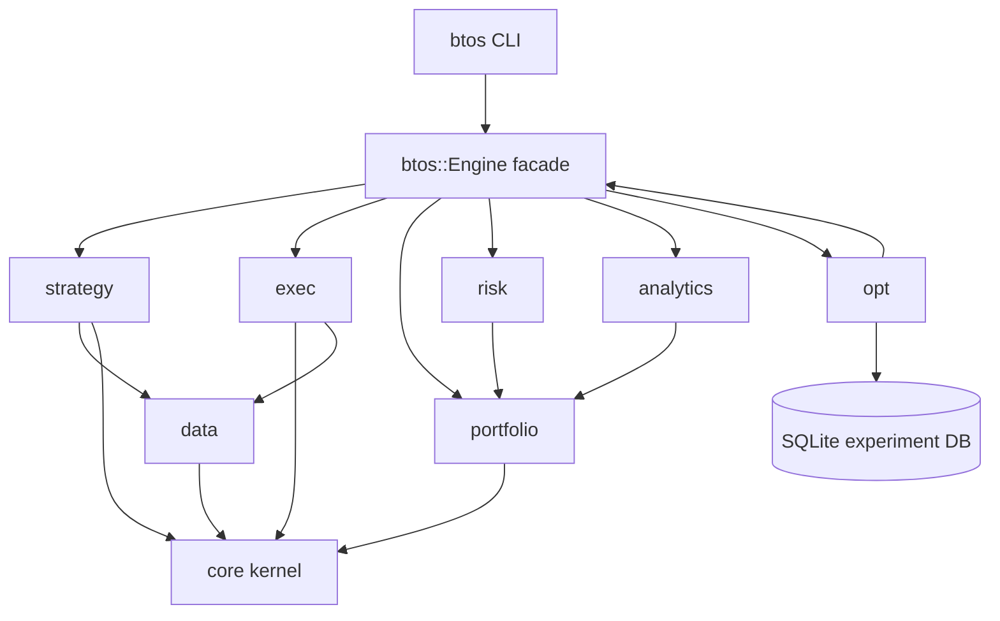
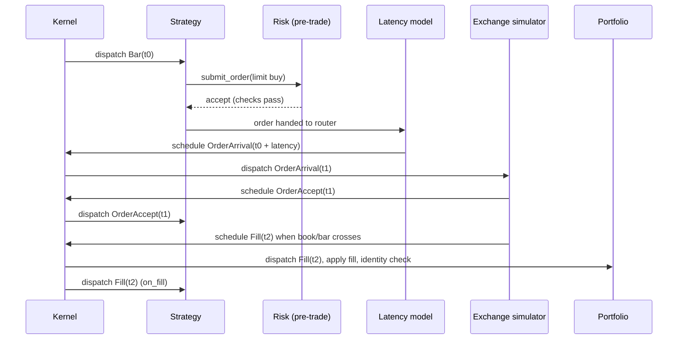

# BTOS Architecture

BTOS (Backtesting Operating System) is a modular, event-driven C++20 platform for
quantitative strategy research: simulation, execution modeling, portfolio accounting,
risk, optimization, and analytics. The design is a microkernel: a minimal deterministic
event kernel (clock, priority queue, dispatch) with every other subsystem attached as a
plugin behind an explicit interface.

## 1. System Overview

The simulation is a pure function of an ordered event stream. A run is defined by
(dataset, configuration, seed). Given the same triple, two runs produce byte-identical
event logs, fill logs, and final portfolio state. All time is `TimestampNs`, a strong
wrapper around `int64_t` epoch nanoseconds. There is no wall-clock dependence anywhere
on the simulation path.

Layers, from the inside out:

1. Kernel (`btos::core`): simulation clock, priority event queue with deterministic
   tie-breaking, subscriber dispatch, event log writer and replayer, seeded RNG
   provider, bounded work-queue thread pool.
2. Data (`btos::data`): instrument master with point-in-time universe membership,
   trading calendar, bar and tick readers, corporate action adjuster (as-of, never
   retroactive), data validation, CSV ingestion, synthetic data generation
   (GBM, Heston, Poisson trade arrival).
3. Execution (`btos::exec`): price-time priority limit order book, matching engine,
   bar-driven conservative fill model, queue position estimator, latency models,
   market impact and slippage models.
4. Portfolio (`btos::portfolio`): multi-currency cash ledger, positions with average
   cost and FIFO tax lots, commission models, margin and leverage checks, financing
   and borrow costs, the accounting identity checker.
5. Strategy (`btos::strategy`): event-driven strategy base class, strategy context
   (order submission, timers, point-in-time data access), vectorized signal adapter,
   state checkpointing, three reference strategies.
6. Risk (`btos::risk`): pre-trade checks, kill switch, historical and parametric VaR,
   expected shortfall, volatility targeting, Kelly sizing.
7. Optimization (`btos::opt`): grid, random, Bayesian (GP with expected improvement),
   CMA-ES, walk-forward analysis, purged K-fold with embargo, deflated Sharpe ratio,
   SQLite experiment tracking.
8. Analytics (`btos::analytics`): performance metrics, drawdown and exposure tables,
   benchmark-relative statistics, self-contained HTML report and metrics JSON.
9. Facade and tooling: `btos::Engine` builder-style C++ API and the `btos` CLI with
   subcommands `ingest`, `validate`, `run`, `optimize`, `report`, `replay`.

## 2. Module Dependency Diagram



Domain objects (Order, Fill, Position, Instrument, Bar, Tick) live in headers with no
infrastructure dependencies: no I/O, no threading, no SQLite, no JSON.

## 3. Event Flow: One Order Lifecycle



Same-timestamp events resolve by the documented priority ladder in section 5.

## 4. Folder and CMake Target Structure

```
btos/
  CMakeLists.txt            top level, presets, FetchContent, install/export
  CMakePresets.json         debug / release / relwithdebinfo / asan / tsan
  include/btos/
    core/      time.hpp ids.hpp events.hpp kernel.hpp event_log.hpp hash.hpp
               rng.hpp thread_pool.hpp config.hpp
    data/      instrument.hpp instrument_master.hpp calendar.hpp bar.hpp
               readers.hpp btosd.hpp corporate_actions.hpp validate.hpp synthetic.hpp
    exec/      order.hpp order_book.hpp matching_engine.hpp fill_models.hpp
               latency.hpp slippage.hpp
    portfolio/ portfolio.hpp commission.hpp fx.hpp
    strategy/  strategy.hpp context.hpp ma_crossover.hpp pairs.hpp market_maker.hpp
               vectorized.hpp
    risk/      pretrade.hpp var.hpp sizing.hpp
    opt/       optimizer.hpp grid_random.hpp bayes_gp.hpp cmaes.hpp validation.hpp
               deflated_sharpe.hpp experiment_db.hpp
    analytics/ metrics.hpp report.hpp
    engine.hpp plugin_abi.h
  src/                      one .cpp per non-header-only unit, target btos_lib
  apps/btos_cli/            target btos (the CLI binary)
  tests/                    target btos_tests (GoogleTest + rapidcheck)
  bench/                    target btos_bench (Google Benchmark)
```

CMake targets: `btos_lib` (static library, all subsystems), `btos` (CLI), `btos_tests`,
`btos_bench`, plus interface targets `btos_warnings` and `btos_sanitizers`. Install and
export rules allow consumption via `find_package(btos)`.

## 5. Kernel Contract

Events are immutable value types held in a `std::variant` payload inside an `Event`
envelope: `{TimestampNs ts, EventPriority priority, uint64_t seq, payload}`.

Deterministic ordering key, ascending: `(ts, priority, seq)`.

Priority ladder (lower dispatches first at equal timestamps):

| Priority | Class           | Rationale                                     |
| -------: | --------------- | --------------------------------------------- |
|        0 | Session         | halts and session boundaries gate everything  |
|        1 | CorporateAction | as-of adjustments precede same-instant data   |
|        2 | MarketData      | bars and ticks before order handling          |
|        3 | OrderAck        | acks before fills, per the ordering invariant |
|        4 | Fill            | fills after acks                              |
|        5 | Timer           | strategy timers last                          |

`seq` is a monotone counter assigned at scheduling time, so insertion order breaks the
final ties and replay is stable. Scheduling an event before the current simulation time
throws: the kernel physically cannot deliver the past, which supports the no-lookahead
invariant. The event log writer serializes every dispatched event to a binary log; the
replayer re-emits an identical stream, and run hashes (FNV-1a 64) prove byte identity.

## 6. Plugin Mechanism

Three tiers:

1. Runtime interfaces: abstract base classes with virtual methods for components chosen
   per run from config (IBarReader, ILatencyModel, ISlippageModel, ICommissionModel,
   IStrategy, IOptimizer, IPreTradeCheck). Plugins receive dependencies through
   constructors. No global state, no singletons.
2. Compile-time policies: hot-path components (bar fill logic, book matching inner
   loop) are also usable as template policies constrained by C++20 concepts
   (`FillPolicy`, `LatencyPolicy` in `fill_models.hpp` / `latency.hpp`) so a research
   build can devirtualize them.
3. Shared-library boundary: `include/btos/plugin_abi.h` defines a stable C ABI
   (`btos_plugin_manifest` with a version tag and factory function pointers returning
   opaque handles). `PluginRegistry` loads `.so` files via `dlopen`, verifies the ABI
   version, and wraps factories into the runtime interfaces. A reference out-of-tree
   plugin is exercised in tests by registering a factory through the same C entry
   point in-process (building a separate `.so` is covered by the registry code path
   and documented; see NOTES.md).

## 7. Configuration Schema

Format: JSON, parsed with nlohmann/json. Justification: a single vendored header with
no build cost, round-trips cleanly to the metrics output and checkpoint format (also
JSON), and hashes canonically (`config_hash` is FNV-1a over the dumped canonical form).
TOML would add a dependency solely for comments.

Top-level schema (all fields validated at load, unknown keys rejected):

```json
{
  "run": {
    "id": "auto|string",
    "seed": 42,
    "start": "2020-01-02T00:00:00Z",
    "end": "2021-01-01T00:00:00Z",
    "initial_capital": 1000000.0,
    "base_currency": "USD"
  },
  "data": {
    "instruments": "path/instruments.csv",
    "bars": [{ "symbol": "SYN1", "path": "data/syn1.btosd" }],
    "calendar": "24x7|us_equity"
  },
  "execution": {
    "fill_model": "conservative_bar|book",
    "latency": { "model": "fixed", "ns": 1000000 },
    "slippage": { "model": "fixed_bps", "bps": 1.0 },
    "commission": { "model": "per_share", "rate": 0.005 }
  },
  "risk": {
    "max_gross_leverage": 2.0,
    "max_position_value": 1e6,
    "max_concentration": 0.25,
    "max_drawdown_kill": 0.2
  },
  "strategy": { "name": "ma_crossover", "params": { "fast": 10, "slow": 30 } },
  "report": { "html": "out/report.html", "metrics": "out/metrics.json" }
}
```

## 8. Third-Party Dependencies

| Dependency       | Version    | Justification                                                                                                                                                                                                                                                                                                                                                                                                                                                                                   |
| ---------------- | ---------- | ----------------------------------------------------------------------------------------------------------------------------------------------------------------------------------------------------------------------------------------------------------------------------------------------------------------------------------------------------------------------------------------------------------------------------------------------------------------------------------------------- |
| nlohmann/json    | 3.11.3     | Config, metrics, checkpoints. Header-only, canonical dump for config hashing.                                                                                                                                                                                                                                                                                                                                                                                                                   |
| SQLite3          | system     | Experiment metadata store, chosen on merit after evaluating DuckDB, LMDB, RocksDB, and flat JSONL: embedded, zero-config, ACID, SQL-queryable, a single portable file, negligible build cost, and the de facto standard backend for run tracking (MLflow default). DuckDB adds a heavy build for no benefit at metadata scale; key-value stores sacrifice ad hoc queryability; a client-server database is unjustified for a single-node research tool. C API used through a thin RAII wrapper. |
| GoogleTest       | 1.14.0     | Unit and integration tests (tests only, not shipped).                                                                                                                                                                                                                                                                                                                                                                                                                                           |
| rapidcheck       | pinned SHA | Property-based tests for the order book and accounting identity (tests only).                                                                                                                                                                                                                                                                                                                                                                                                                   |
| Google Benchmark | 1.8.3      | Kernel and matching-engine throughput measurement (bench only).                                                                                                                                                                                                                                                                                                                                                                                                                                 |

Apache Arrow/Parquet is specified by the stack for dataset storage. The build
environment for this delivery cannot fetch or compile Arrow (network allow-list and
single-core build budget), so datasets are stored in `.btosd`, an in-project
memory-mappable columnar binary format with the same reader interface
(`IBarReader` / `ITickReader`). A `ParquetBarReader` is a named extension point:
implement `IBarReader` over `arrow::io::MemoryMappedFile` plus
`parquet::arrow::FileReader` and register it in the reader factory. This deferral is
recorded in NOTES.md and is interface-compatible by construction.

## 9. Ownership Model per Subsystem

- Kernel owns the event queue and the dispatch table; subscribers are
  `std::function` values owned by the kernel, capturing non-owning references to
  components owned by the Engine.
- Engine owns every plugin via `std::unique_ptr` and wires constructor injection.
  Components never own each other; cross-references are `const&` or raw non-owning
  pointers documented as non-owning.
- Data readers own their file mappings (RAII wrapper around mmap).
- The order book owns resting orders by value inside its levels.
- No raw owning pointers, no manual new/delete outside the mmap RAII wrapper and the
  C ABI boundary (where creation/destruction pairs are matched factory functions).

## 10. v2 Extension Points (non-goals for v1)

Each item below has a named interface hook; one paragraph each.

- Options pricing and Greeks: `Instrument` carries an `AssetClass` and an optional
  `InstrumentTerms` payload; an `options` plugin adds a terms struct (strike, expiry,
  style) plus an `IRiskModel` implementation producing Greeks consumed by the risk
  engine next to VaR. No kernel or portfolio changes required: fills and positions are
  already multiplier-aware.
- Fixed income analytics: same `InstrumentTerms` mechanism (coupon schedule, daycount)
  plus an accrual hook in the portfolio financing model (`IFinancingModel`).
- Prediction markets: an `AssetClass::Other` instrument with 0/1 settlement handled by
  a `SettlementEvent` producer plugin feeding the existing corporate-action pathway.
- Satellite/news/sentiment ingestion: alternative data enters as a new event payload
  type (`AltDataEvent`) dispatched at MarketData priority; readers implement
  `IEventFeed`, the same interface the bar feed uses.
- LLM research assistants and AutoML: consumers of the experiment DB; the SQLite schema
  and CLI query surface are the integration boundary. Nothing inside the simulator.
- Distributed cluster execution: the optimizer evaluates candidates through
  `IEvaluationBackend` (v1 ships thread-pool and forked-process reference backends).
  A cluster scheduler implements the same backend interface; the work queue is already
  bounded and pull-based so it maps onto a remote queue.
- Hidden liquidity and iceberg simulation: the book exposes `ILiquidityAugmenter`,
  invoked per level during matching; v1 registers none.
- Live broker connectivity: `IOrderRouter` is the seam between strategy context and
  the exchange simulator; a live router implements the same interface against a broker
  API and consumes real acks/fills as kernel events.
- Language bindings (pybind11): the `btos::Engine` facade is binding-friendly: plain
  structs, `std::string` and `double` at the surface, no template types in signatures.
- REST/gRPC/WebSocket services: a service host owns an Engine per request/session and
  translates HTTP to the facade. Boundary: the facade plus the metrics JSON schema.
  Not implemented in v1.
- Algo orders (TWAP/VWAP/iceberg/pegged/trailing): `IAlgoOrder` in `exec` slices a
  parent order into child orders via timer events; v1 ships the interface only.
- Auctions: the calendar emits `SessionEvent`; a v2 auction module
  subscribes and runs a crossing at those events. Halts and circuit breakers ship in v1
  through the same SessionEvent pathway.

## 11. Correctness Invariants and Their Tests

| Invariant            | Test                                                                                                    |
| -------------------- | ------------------------------------------------------------------------------------------------------- |
| No lookahead         | `test_invariant_no_lookahead`                                                                           |
| Point-in-time data   | `test_invariant_point_in_time`, `test_invariant_survivorship`                                           |
| Deterministic replay | `test_invariant_deterministic_replay`                                                                   |
| Event ordering       | `test_invariant_event_ordering`                                                                         |
| Accounting identity  | `test_invariant_accounting_identity` plus a debug-mode check after every fill (`BTOS_DEBUG_ACCOUNTING`) |
